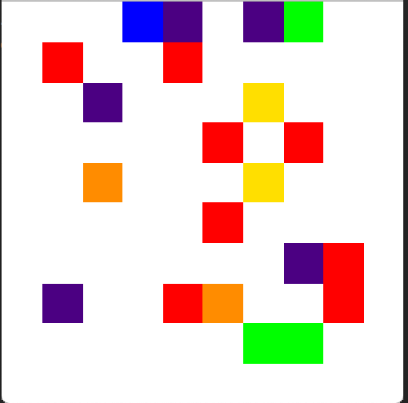
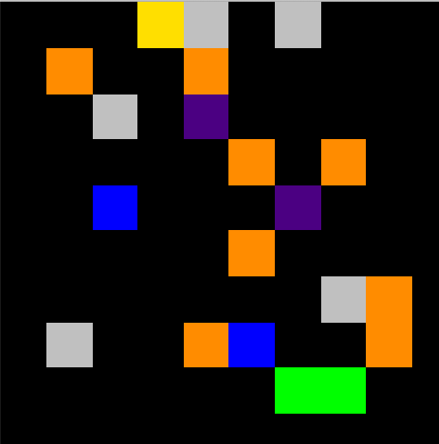
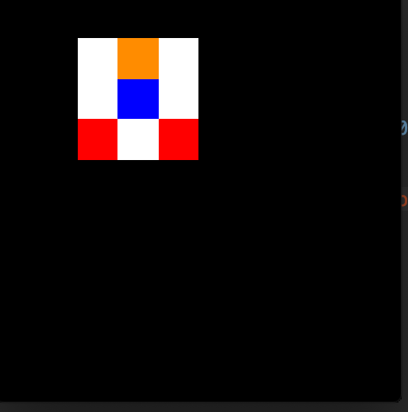
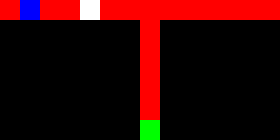

# krazyworld 2.0
Used in our paper "On the Importance of Sampling in Meta Reinforcement Learning."
Good for testing exploration in a meta-RL setting.





This version of krazy world no longer uses PyGame! 
Instead, the grids are written directly to numpy. 
This makes it faster and also avoids PyGame. 


## Features 

Lets look at the constructor for krazyworld and go over each of its arguments

```

kw = KrazyGridWorld(screen_height=256, grid_squares_per_row=10,
                        one_hot_obs=False, use_local_obs=False, image_obs=True,
                        seed=42, task_seed=68, init_pos_seed=70,
                        num_goals=3, max_goal_distance=np.inf, min_goal_distance=2,
                        death_square_percentage=0.08,
                        num_steps_before_energy_needed=50, energy_sq_perc=0.05, energy_replenish=8,
                        num_transporters=1,
                        ice_sq_perc=0.05,
                        )
```

`screen height` is the size of the screen. Only square screens are supported, 
so this is also the width 

`grid_squares_per_row` is the number of grid elements in each row. 
The total grid is `grid_squares_per_row*grid_squares_per_row` in size. 

`imgage_obs` Whether you want your observations as a 

`(screen_height, screen_height, 3)` 

RGB array or as a vector representation of the grid. 
If you choose `imgage_obs=True`, the grid will be rendered straight to a 
numpy int array and 
the resulting array will be returned to you. 
No external rendering library is called, saving the headaches of pygame etc. 

`one_hot_obs` is applicable only when you receive the observations as a state matrix. 
If true, you'll receive a numpy array of size 

`(grid_squares_per_row, grid_squares_per_row, number_of_tile_types)`

with number_of_tile_types being one_hot encoded according to which 
type of tile lives in that spot in the grid. 


`use_local_obs` If this is true then the agent will only receive observations in a 
neighborhood about itself. It will not see the whole grid, making the problem
much harder. 




`seed, task_seed, init_pos_seed` are used to control RNG.

`task_seed` sets the RNG for which tasks you draw. 
`init_pos_seed` sets the RNG for the agent's initial position.
`seed` controls both. 

`num_goals, max_goal_distance, min_goal_distance` control the number of 
goals on the grid and how far they are from the agent's start position. 
The agent gets a reward for reaching these goals. 

`death_square_percentage` Percentage of death squares. 
Not really a percent, actually the proportion. 
Takes values between 0 and 1. These squares kill the agent when it lands there. 

`energy_sq_perc` Percentage of energy squares. 
Not really a percent, actually the proportion. 
Takes values between 0 and 1. These squares provide the agent with energy. 
If the agent runs out of energy, it's game over. 


`num_steps_before_energy_needed` is the number of steps the agent can move before 
it needs to replenish energy. Setting this to 
`np.inf` means the agent will never run out of energy. 

`energy_replenish` The number of extra moves the agent gains each time 
it picks up an energy square. 


`num_transporters` Sets the number of pairs of transporters on the map. 
Each transporter moves the agent across the map onto another 
transporter square. 

`ice_sq_perc` Agents slide over ice squares. It does not cost energy. 
If consecutive ice squares are encountered, the agent will keep sliding until 
it hits a wall or transverses the last ice square. 
The agent will continue to travel in its original direction over ice squares, 
as if it had momentum in that direction. 

## The reset function
`kw.reset(reset_board=False, reset_colors=False, reset_agent_start_pos=False, reset_dynamics=False)`

The reset function takes 4 arguments, which are used to control how much the agent resets. 

`reset_board` samples a new MDP from the task distribution. 
The location of all the tiles change, as well as the agent's start position. 

`reset_agent_start_pos` keeps the same grid (MDP) but 
starts the agent from a new position. 

`reset_colors` changes the color of each tile type. For example, 
by default the death squares are red. However, if we call this function 
they will be some other color chosen at random. 

`reset_dynamics` The agent's dynamics change. 
By default, action 0 is up and action 1 is down, etc. 
When this function is called the mapping of the action indexes to the 
action the agent takes are scrambled. 

If all of these arguments are set to False, the agent will simply 
reset to the same board with the same start position as before. 
The agents energy will reset to its standard amount. 


# Kontrived Grid

Also featuring kontrived_grid, which is just one grid that has been designed to make
exploration difficult. This is not a good benchmark for meta RL.
However, it's a decent benchmark for exploration in RL in general.
You might want to start there.
If your algorithm can't solve that problem,
it likely can't solve the harder krazy world.




**Bradly Stadie. Ge Yang. Written with :heart:**