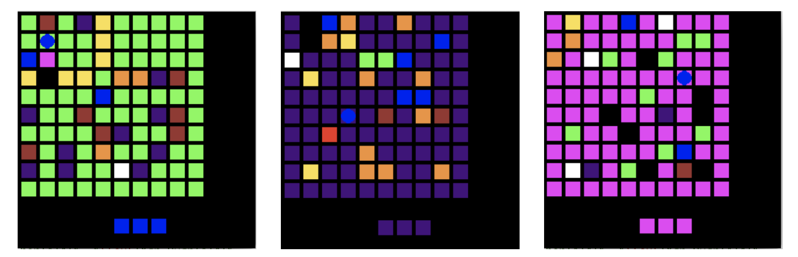

# krazyworld
Used in our paper "On the Importance of Sampling in Meta Reinforcement Learning."
Good for testing exploration in a meta-RL setting.

Also featuring kontrived_grid, which is just one grid that has been designed to make
exploration difficult. This is not a good benchmark for meta RL.
However, it's a decent benchmark for exploration in RL in general.
You might want to start there.
If your algorithm can't solve that problem,
it likely can't solve the harder krazy world.

